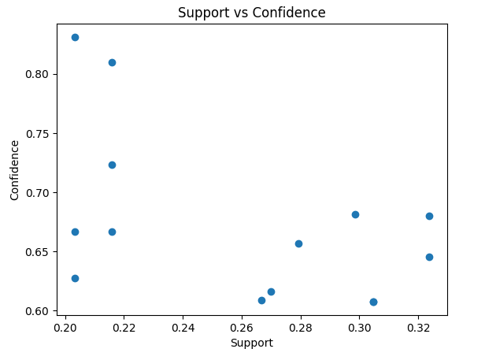
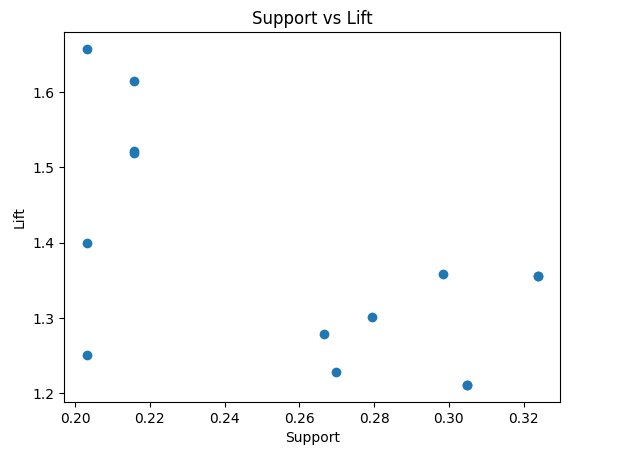
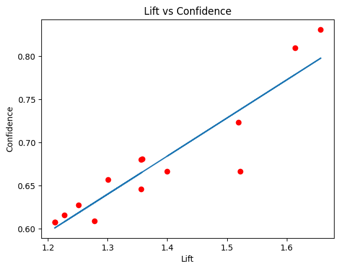

# Frequent Pattern Mining 

This project demonstrates frequent pattern mining & association rule generation using the Apriori algorithm. It includes data preprocessing, one-hot encoding and insightful visualizations like support vs. confidence and lift vs. confidence. Ideal for market basket analysis and similar tasks.

## **Features**
- Data preprocessing and cleaning
- One-hot encoding of transaction data
- Frequent itemset generation using the Apriori algorithm
- Association rule mining with metrics like confidence, lift and support
- Visualizations to analyze relationships


## **Example Outputs**
- **Frequent Itemsets:**
  ```
  support  itemsets
  0.50     [Milk]
  0.42     [Bread]
  ```
- **Association Rules:**
  ```
  antecedents  consequents  support  confidence  lift
  [Milk]       [Bread]      0.25     0.80        1.25
  ```

## **Results**
The following visualizations provide insights into the frequent pattern mining and association rules derived from the dataset:

### 1. **Support vs Confidence**

**Insights:**
  - Rules with higher support generally exhibit a wide range of confidence values.
  - A few rules achieve high confidence (> 0.8) but may have lower support.




### 2. **Support vs Lift**
**Insights:**
  - Rules with low support can still achieve high lift values, indicating strong associations.
  - Lift values stabilize as support increases, suggesting more frequent itemsets may not always have significantly stronger associations.




### 3. **Lift vs Confidence**

- **Insights:**
  - There is a clear positive correlation between lift and confidence.
  - Rules with higher lift values (indicating strong associations) also tend to exhibit higher confidence.




## **License**
This project is licensed under the MIT License. See the [LICENSE](LICENSE) file for details.
